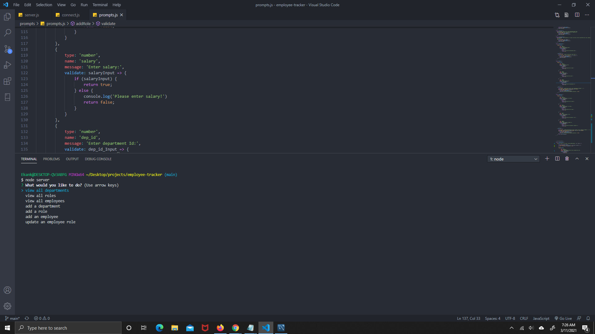

  # Employee Tracker

  ## Description
  A Content management system (CMS) commandline application to manage company's employee database using Node.js, Inquirer and MySQL.
    
  ## Table of Contents (Optional)
  If your README is very long, add a table of contents to make it easy for users to find what they need.
  * [Description](#description)
  * [Installation](#installation)
  * [Usage](#usage)
  * [Features](#features)
  * [Tests](#tests)
  * [Questions](#questions)
 

   
    
  ## Installation
  * Clone repo on to local machine and install npm init. Once npm is initialized, go to your terminal and run 'node server'
    
  ## Usage
  

  For a video walk-through, please click on the link [https://youtu.be/zVY-f36VTbU](https://youtu.be/zVY-f36VTbU)
  
    
  ## Features
  Employee Tracker

  ## Tests
  clone repo. Go to terminal and install npm init and then run node server.

  ## Questions
  If you have any questions or comment about this repository, you can reach me at [e.kankam95@hotmail.com](mailto:e.kankam95@hotmail.com).
  Feel free to view more of my work on GitHub at [kwabena95](https://github.com/kwabena95)